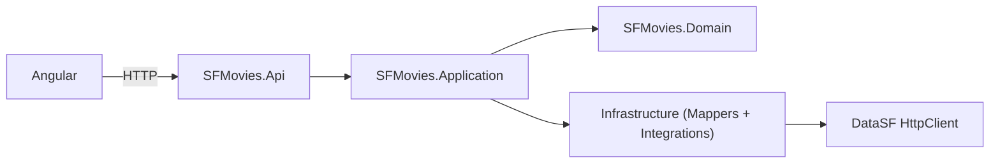

# Arquitectura

## Visión general
Arquitectura **Clean** con separación de capas y dependencias unidireccionales:

# Infrastructure

## Integrations
- **DataSfClient** (HttpClient → DataSF): mapea Row externo → Dominio.  

## Mappers
- Conversión de modelos externos al dominio.  
- Lógica de parseo de datos no normalizados(ej: `release_year` como string).  

## API
- Controladores REST.  
- Dependency Injection.  
- Swagger habilitable.  
- Caching en memoria (TTL breve) para aliviar rate limits.  

## Decisiones
- **Sin DB**: lectura directa de DataSF (Socrata). Se mapea a dominio y se expone como DTO propio.  
- **Autocomplete**: endpoint `/api/movies/suggest` con `prefix` y `limit`, Distinct case-insensitive.  
- **Mapa**: Leaflet en UI; markers por MovieLocation con popup (título, año, director, cast).
- **Cache**: In memory cache para resultados de sugerencias.  
- **CORS**: configurado por `Cors:AllowedOrigins`.  

## Configuración
- `Socrata:BaseUrl`, `Socrata:ResourcePath`, `Socrata:AppToken`.  
- `Cors:AllowedOrigins: [ "https://<tu-ui>" ]`.  
- `Swagger:Enabled` (permite activar en producción para validación).  

## Errores / Edge cases
- `release_year` puede venir como string → se parsea seguro.  
- Lat/long a veces ausentes → se omiten markers sin coordenadas.  
- Fuente de datos no normalizada → se agrupan en backend.  
